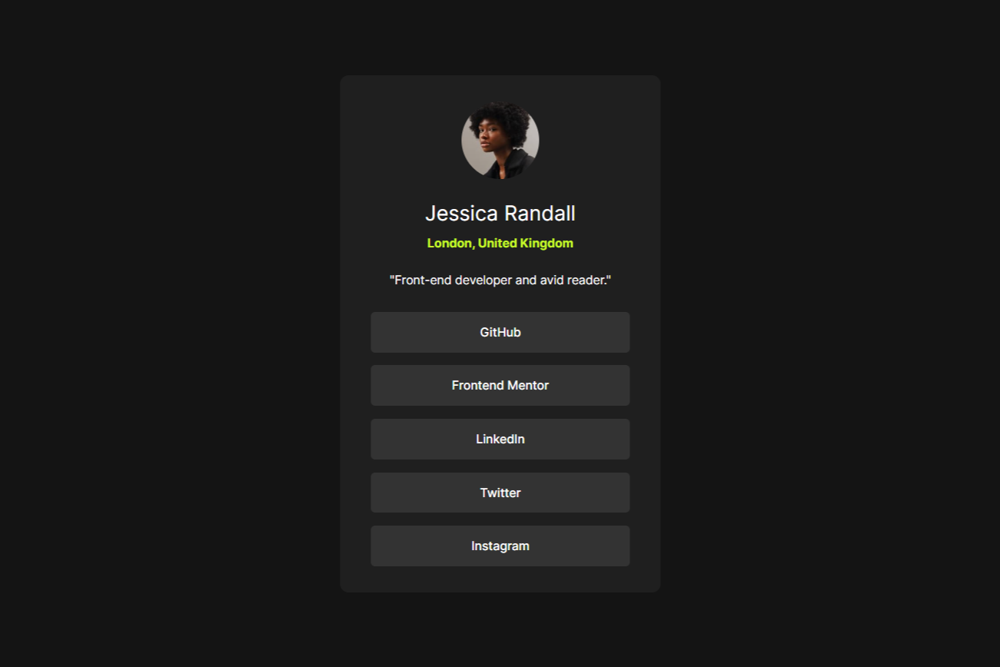

# Frontend Mentor - Social links profile solution
## Table of contents

- [Overview](#overview)
  - [Screenshot](#screenshot)
  - [Links](#links)
- [My process](#my-process)
  - [Built with](#built-with)
  - [What I learned](#what-i-learned)
  - [Continued development](#continued-development)
- [Author](#author)

## Overview

### Screenshot

### Links

- Live Site URL: [Add live site URL here](https://alfonsovidrio.github.io/social-profile-component/)

## My process

### Built with

- Semantic HTML5 markup
- CSS custom properties
- Flexbox

### What I learned

This challenge helped me practice using Flexbox and choose more appropriate names for my classes.

### Continued development

In future projects, I want to optimize the speed at which I implement designs, as I sometimes get distracted by details that aren’t as relevant, which leads me to lose time. Additionally, I will focus on improving my CSS skills by using CSS Grid to complement Flexbox and create more complex layouts. I also plan to refine my CSS coding practices by concentrating on modularity and implementing methodologies like BEM for better organization and maintainability. Finally, I intend to delve into performance optimization techniques and ensure that my designs are fully responsive and accessible, applying best practices for web accessibility.

## Author

- Frontend Mentor - [Alfonso Vidrio](https://www.frontendmentor.io/profile/AlfonsoVidrio)
- LinkedIn - [Alfonso Manuel Vidrio Lizaola](https://www.linkedin.com/in/alfonsomanuelvidriolizaola/)